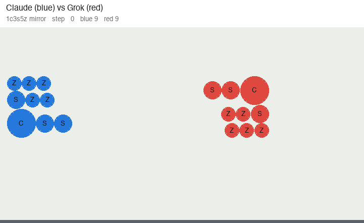
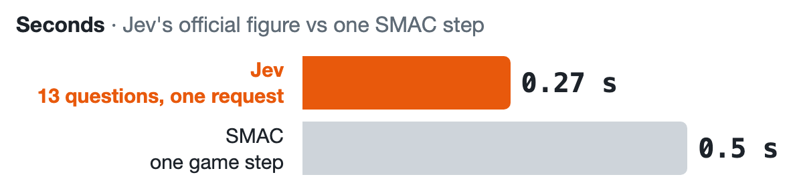
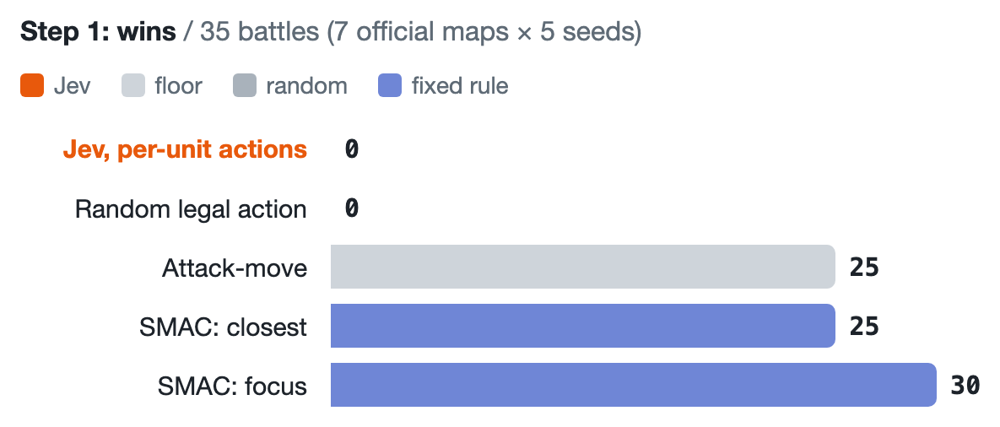
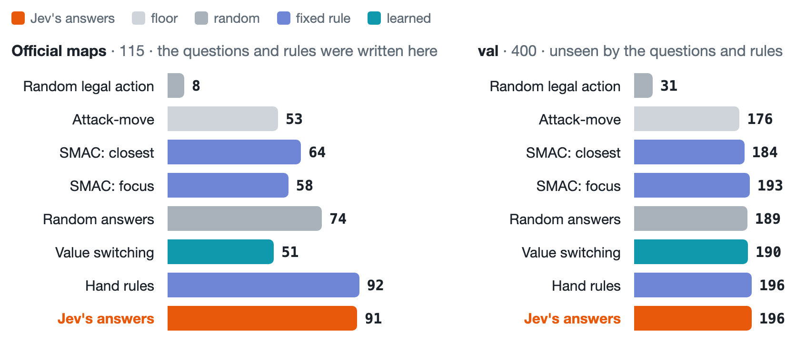
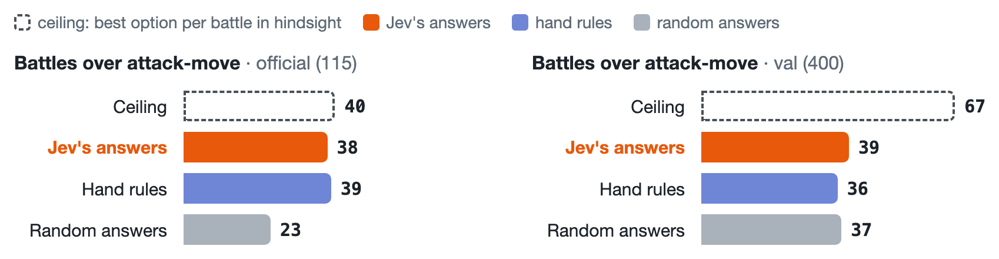
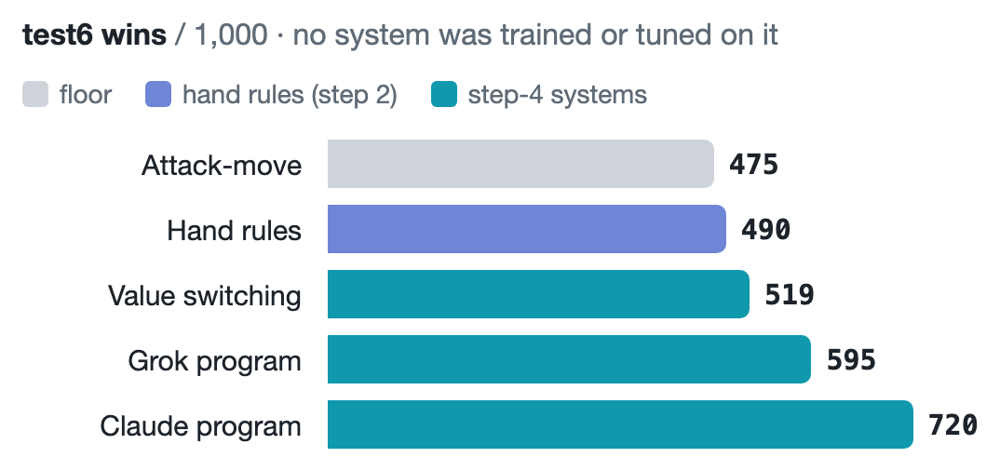
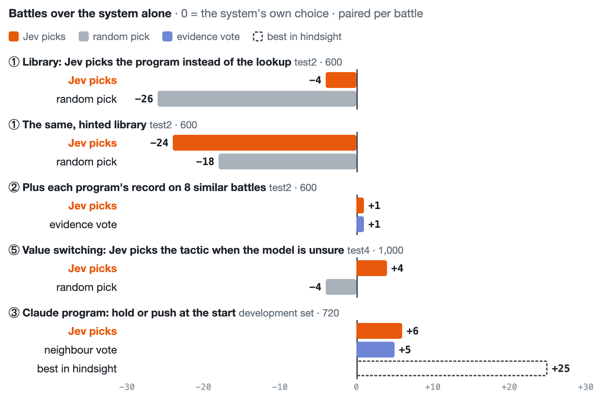
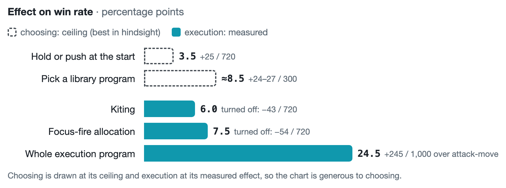
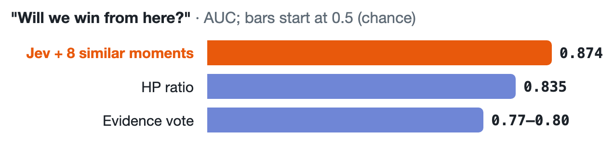

# Jev on SMAC: Can a Fast Choice Model Play StarCraft Micro?

> We set out to see if **Jev**, a fast model that picks among named options, could act as the policy in StarCraft multi-agent micro (SMAC).
> We went down four steps, each one prompted by why the last one failed, and compared every step with baselines that had the same information but no Jev.
>
> | Step | What Jev controlled | Result |
> |---|---|---|
> | 1. Every unit's action | Each unit's raw action, every 0.5 s step | **0 / 35 wins**, the same as random actions. Attack-move won 25. |
> | 2. Tactics per unit group | 2–6 named tactics per group (how to fight, whom to focus); code executes | **91 / 115** on the official maps. But random answers to the same questions won 74, and 4 hand-written rules built from the same knowledge won 92. The credit belongs to the code and the rules, not to Jev. |
> | 3. The same, on unseen battles | – | **196 / 400**, tied with the hand rules (196) and with SMAC's three-line focus-fire rule (193). The tactical knowledge was fitted to the official maps, and Jev added no judgment of its own. |
> | 4. Choosing on top of systems built to generalize | Library programs, value-model tactics, hold or push | Each system generalized better than the one before (**475 → 720 / 1,000** unseen battles). Jev never added anything on top. |
> | **Is Jev useful for micro?** | | **No.** Its one strength is judging *"will we win?"* (AUC 0.874, best of all methods, not significant), and in micro that judgment doesn't turn into wins. What worked: an LLM writes the micro **code**. |

<p align="center">
  
</p>
<p align="center"><sub>
Unseen test battle <code>y0810</code>, seed 4: 4 Stalkers (blue) vs 5 Hydralisks (red), with a wall and a single gap.
Fill = remaining HP; lines = current attack target.
<b>Left:</b> attack-move, damage spread across targets, all four Stalkers dead.
<b>Right:</b> the LLM-written program holds back and focuses one Hydralisk at a time as they come through the gap. No Stalker dies.
</sub></p>

<p align="center">
  
</p>
<p align="center"><sub>
And the two LLM-written programs against each other: Claude's (blue) vs Grok's (red), the same army on both sides (<code>1c3s5z</code>, seed 1).
Over 9 mirror maps × 3 seeds, each program playing each side once: <b>Claude 48, Grok 5, 1 draw</b>
(<code>python results/duel.py tally</code>; the simulator is unchanged, the red side's orders come from Grok's program each step).
</sub></p>

## Why we tried this

**Jev looks like an RL actor.** Jev ([TypeSafe](https://docs.typesafe.ai) System One) does not generate text. You give it a state and a question with named options, and it returns a calibrated probability for each option. That is the same shape as the discrete action head of an RL policy: a state goes in, and a distribution over actions comes out. Unlike an RL policy, it needs no training. Jev is never fine-tuned; you only change the state and the question.

**Jev is fast.** Official figures ([models](https://docs.typesafe.ai/models), [parallel questions](https://docs.typesafe.ai/cookbooks/parallel_questions)):

<p align="center"></p>

<details>
<summary>Full figures (separate requests, rate limit, JEV-Star)</summary>

| | Figure |
|---|---|
| 13 questions about a ~54,000-character document, in one request | **0.27 s** |
| The same 13 questions as 13 separate requests | 2.71 s in total (≈ 0.21 s each) |
| Rate limit | 80 requests/s, 100K tokens/s |
| Questions within one request | evaluated in parallel, independently |
| Median response in real-time SC2 (external project [JEV-Star](https://github.com/sc2musa/Jev_Star)) | 0.38–0.42 s |

</details>

A SMAC step is 0.5 s of game time, so on paper Jev is fast enough to choose an action every step.

## Setup and baselines

**Environment.** [SMAClite](smaclite/), a Python re-implementation of SMAC that runs without StarCraft II. One step = 8 ticks ≈ 0.5 s, and a timeout counts as a loss. The game waits for the policy, so latency costs wall-clock time, not wins.

**Battles.** Every score in this README is battles won, out of a fixed set of battles from one of two sources.

**1. Official maps: 115 battles.**
- The 23 SMAC maps (3m, 2s3z, MMM2, corridor, …), designed by hand by the SMAC authors, × 5 seeds.
- The step-2 questions, the gate and the hand rules were written by looking at these maps, so for all three the official maps are in-sample.
- Step 1's 35 battles are 7 of these maps × 5 seeds: 3m, 8m, 5m_vs_6m, 2s3z, 3s5z, 3s_vs_3z, 10m_vs_11m.

**2. Generated battles: fights nobody looked at while writing rules.** Built by [`src/scenarios.py`](src/scenarios.py).

- **A scenario is one fight, drawn at random:**

  | Part | How it is drawn |
  |---|---|
  | Terrain | open field (47% of scenarios), wall with a gap (29%), ravine (10%), octagon (7%), corridor (7%) |
  | Our army | 1–3 of 8 unit types (Marine, Marauder, Stalker, Zealot, Colossus, Zergling, Baneling, Hydralisk), sometimes plus Medivacs; 2–30 units, median 10 |
  | Enemy army | drawn the same way, independently, worth 0.8–1.3× our army; 1–40 units, median 12 |
  | Time limit | 150 steps, or 220 with 40+ units in total; a timeout is a loss |

  Example, `y0999`: open field, 4 Stalkers vs 2 Stalkers + 1 Colossus.
- **Only contested fights are kept.** A fight is dropped if attack-move wins it on all 5 seeds, or if attack-move and random answers both lose all 5.
- **A seed replays the same scenario.** The armies and terrain stay the same. Both spawn points move by up to 1.5, and the engine's randomness changes. So a new seed of a training scenario is still training data.
- **A split is a batch of scenarios drawn separately,** with its own random seed and id prefix.
  - Different splits hold **different fights**, not the same fights with new seeds.
  - All splits come from the same generator, so "unseen" means new fights from the same distribution. The official maps are a different distribution.
  - Overlap: 4 of the 1,040 val and test scenarios happen to equal a train or train2 scenario (small armies drawn twice).

| Split | id prefix | Scenarios | Battles (× 5 seeds) | Role | Used for |
|---|:-:|---:|---:|---|---|
| train | g | 60 | 300 | training | step 4: all four systems (some used up to 10 seeds) |
| train2 | t | 120 | 600 | training | step 4: value switching, the Claude program |
| val | v | 80 | 400 | validation | steps 1–3: the unseen check, since nothing in steps 1–3 was built or tuned on it. Step 4: thresholds, Jev variants, go / no-go for the two programs |
| test | g¹ | 40 | 200 | test | step 4: library (round 3) |
| test2 | h | 120 | 600 | test | step 4: library (round 4); Jev ① and ② |
| test3 | u | 200 | 1,000 | test | step 4: value switching |
| test4 | w | 200 | 1,000 | test | step 4: value switching again; Jev ⑤ |
| test5 | x | 200 | 1,000 | test | step 4: Grok program |
| test6 | y | 200 | 1,000 | test | step 4: Claude program. Run in the same pass: value switching, Grok program, attack-move, hand rules (step 3) |

<sub>¹ train and test were drawn as one batch and then split, so they share a prefix but no scenarios.</sub>

Each test set was run once and decided one thing. The exception is test2, which decided two things (① in round 4, ② in round 5).

**Statistics.** Every comparison is paired by scenario and seed, with an exact sign test on flips vs losses.

**How the baselines are designed.** Every step asks the same question: *does Jev add judgment beyond what we hand it?* What we hand it is an output space (the options it picks from) and some knowledge (the option text, the manual, the examples). So each step gets the same four kinds of control:

| Role | What it rules out | Step 1 (Jev picks each unit's action) | Steps 2–3 (Jev picks group tactics) | Step 4 (Jev picks among systems) |
|---|---|---|---|---|
| **Floor** | the system is no good at all | attack-move | attack-move | attack-move |
| **Random, same output space** | the gain comes from the options, not from choosing | random legal action | random answers to the same questions | random pick among the same candidates |
| **Fixed rule, same output space** | the gain comes from knowledge a rule already encodes | SMAC heuristic (*closest*, *focus*) | hand rules | lookup / evidence vote over the same examples |
| **Ceiling** | there was nothing to gain anyway | – | best option per battle in hindsight | best option per battle in hindsight |

The controls change from step to step only because Jev's output space changes: a "random answer" means something different when the answer is a unit's action than when it is a tactic. The roles stay fixed.

- **Attack-move:** every unit attack-moves toward the enemy. The last fallback in every system here.
- **SMAC heuristic:** shoot the closest enemy in range (*closest*) or the lowest-HP one (*focus*), else walk toward it.
- **Hand rules:** 4 fixed picks, written by looking at the official maps. Whenever the question is open: gun lines kite, melee holds the choke, the laser aims at the bar, outer guns step aside.

## Steps 1–3. Jev as the policy

Steps 1 and 2 give Jev two different things to choose; step 3 takes the step-2 system to unseen battles. All three are read off one table below.

### Step 1. Jev controls every unit's action

**Setup.** One Jev request per step, with one Choice per living unit.
- **Input:** every unit on both sides: type, HP, shield, position, range, speed, damage, weapon cooldown.
- **Options:** exactly that unit's legal actions.
  - stop;
  - move north / south / east / west, with the distance to the nearest enemy after the move;
  - attack enemy *j*, with its type, remaining HP, distance, and whether it is in range.
- **Output:** one action per unit, applied for 0.5 s.

**Result: 0 / 35 wins, the same as random legal actions** (full table under *Results of steps 1–3*). On 3m (seed 1), it walked all three Marines east (P = 0.95), then split their fire across all three enemies; the enemy didn't split, and won with 2 units left. Three candidate causes:
1. **The action space is large.** Each unit has 6–17 actions every 0.5 s, and a battle needs dozens of steps in a row to go right.
2. **The questions can't coordinate.** Questions in one request are scored independently ([docs](https://docs.typesafe.ai/cookbooks/parallel_questions)). Focus fire, the most valuable thing in micro, is a joint assignment of who shoots whom. A three-line rule, *focus the lowest HP in range*, wins 10m_vs_11m 5/5, where attack-move and Jev both lose 5/5.
3. **The differences between actions are numeric.** Range, cooldown, and distance decide the fight. Asked for P(win) after each of 13 actions at 300 recorded decision points, Jev's answers varied by a standard deviation of only 0.047 (card ⑦ below).

It is also slow at this scale. 1.23 s per request is longer than a 0.5 s step.

<p align="center"></p>

### Step 2. Reduce the dimensions: Jev picks tactics per unit group, code executes

**Why this step.** It removes all three candidate causes at once:
- Units are grouped by role, and each group gets 2–6 named tactics instead of per-unit actions every step.
- Code coordinates: one targeting rule makes the whole army focus the same enemy.
- Code does the numeric execution: who shoots when, who steps where.

This is how a human commander works, with control groups instead of per-unit clicks. It is also how hierarchical multi-agent RL methods such as RODE (ICLR 2021) shrink the action space on SMAC. And it fits Jev's design: a choice question with named options whose meanings differ clearly.

**Setup.** Units are split into a gun line (ranged), a melee line, and healers. At each step where a question is open, Jev gets one request with up to 7 independent Choices:

| Question | Options |
|---|---|
| How should the gun line fight? | stand and shoot / kite (stutter step) |
| What should the melee line do? | charge / hold the choke (/ snipe suicide units) |
| Which targeting rule should the army use? | front line / weakest in range / clump / heaviest / guns first / healer first |
| Where should a firing laser aim? | the densest enemy / the perpendicular bar that hits the most bodies |
| Before contact, should the outer guns step aside? | stay / step |
| Two enemies in range are within one shot of each other: which first? | either one |
| Which wounded ally should the healer heal? | up to 6 wounded allies |

- **Input:** the battle state, plus physical facts attached to each option. Examples: *"if this line stands, the melee reaches it before the next shot"*, speed advantage, numbers, contact, and for each targeting rule the enemy it picks and how tanky it is.
- **Output:** one option per question, with probabilities. Code compiles the picks into every unit's action, every step.
- **Gate:** a question reaches Jev only if pinning one of its options beat attack-move somewhere on the official maps. Otherwise code answers with its default.
- **Cost:** 10.5 requests per battle (0.23 per step), instead of 1 per step.

### Results of steps 1–3

Every policy plays the same battles: step 1's 35 (7 official maps × 5 seeds: 3m, 8m, 5m_vs_6m, 2s3z, 3s5z, 3s_vs_3z, 10m_vs_11m), all 115 official battles, and the 400 val battles, which were never used to write the questions or the rules. The last two columns pair Jev's step-2 answers with each row (flips / losses).

<p align="center"></p>

<details>
<summary>Full table, with step 1's 35 battles and paired flips / losses vs Jev's answers</summary>

| | Role | Step 1's 35 | Official (115) | val (400) | Jev's answers vs this, official | Jev's answers vs this, val |
|---|---|---:|---:|---:|---:|---:|
| Attack-move | floor | 25 | 53 | 176 | +38 / −0 | +43 / −23 (p = 0.019) |
| Random legal action | random, step-1 options | 0 | 8 | 31 | +83 / −0 | +177 / −12 |
| SMAC heuristic: closest | fixed rule, step-1 options | 25 | 64 | 184 | +29 / −2 | +69 / −57 (p = 0.33) |
| SMAC heuristic: focus | fixed rule, step-1 options | 30 | 58 | 193 | +33 / −0 | +66 / −63 (p = 0.86) |
| **Jev, every unit's action (step 1)** | | **0** | – | – | | |
| Random answers | random, step-2 options | 34 | 74 | 189 | **+17 / −0** (p < 0.001) | +37 / −30 (p = 0.46) |
| Hand rules | fixed rule, step-2 options | 35 | 92¹ | 196 | +1 / −2 (p = 1.0) | +20 / −20 (p = 1.0) |
| **Jev's answers (steps 2–3)** | | **35** | **91**¹ | **196** | – | – |

</details>

<sub>¹ In-sample: the hand rules and the exam questions were written by looking at the official maps. Jev per unit ran on the 35 battles only (745 requests, 1.23 s each, 26 s per battle), where it already tied random actions. External reference: in real SC2, [JEV-Star](https://github.com/sc2musa/Jev_Star)'s Jev alone won 3 / 105 on 35 SMAC-Hard maps. Rerun everything: `python results/baseline_rerun.py unit` / `local` / `jev`, then `table`; step 1's Jev rows: `python results/q1_unit_actor.py table`.</sub>

**Step 1: Jev won none.** It tied random legal actions, and every fixed rule beat it (0 / 25 against attack-move).

**Step 2: on the official maps it works, but Jev is not the reason.** Lowering the dimensions moved Jev from 0 to 35 of the same 35 battles. That fits cause 1 but does not prove it: random answers went to 34 as well, so the code made most of the jump. Jev did beat random answers (+17 / −0 over 115). But 4 fixed rules, written from the same official maps that the questions and their option text came from, did just as well with no requests at all.

**Step 3: on unseen battles it doesn't hold.** Jev's edge over random answers fell from +17 / 115 to **+7 / 400**, and it still tied the hand rules exactly. The whole step-2 system, with Jev, was no better than step 1's three-line focus-fire rule (196 vs 193), which it had beaten +33 / −0 on the official maps. On test6 (1,000 unseen battles), the hand rules won 490 vs attack-move's 475, also not significant.

**Why step 3 failed: the tactical knowledge was fitted to the official maps, and Jev added none of its own.** We pinned each option of the menu for the whole battle and played every battle again. The best pin per battle, in hindsight, is a ceiling for what any answerer could get from this menu:

<p align="center"></p>

<details>
<summary>Full table</summary>

| | Official maps (115) | val (400) |
|---|---:|---:|
| The menu's ceiling: battles over attack-move | +40 | +67 |
| captured by Jev's answers | **38** | **39** |
| captured by the hand rules | 39 | 36 |
| captured by random answers | 23 | 37 |
| Battles attack-move won and Jev lost | 0 | 23 |
| The best option on the official maps (kite), over attack-move | +20 | +1 |

</details>

<sub>`python results/baseline_rerun.py force` then `headroom`; 12 pins (6 questions, plus each of the 6 targeting rules). On val many pins flip battles both ways (e.g. *guns first* +25 / −26), so part of the +67 is chance rather than usable room.</sub>

- **The knowledge didn't transfer.** On the official maps, the gun-line kite was the option that won; on val it was worth +1. The hand rules carry exactly this knowledge, and they lost their edge with it.
- **Jev didn't make up for it.** On val the menu still had room, and Jev captured as much of it as random answers did (39 vs 37). On the official maps it captured 38 of 40, because its option text and its gate were written from those maps.

<details>
<summary><b>Was the evidence gate too strict?</b> No: the questions it closed add only +6 of 400 to the ceiling.</summary>

<br>

The gate closed 5 kinds of question: formation, kite style, bait, stand, and mark. No pin of theirs had beaten attack-move on the official maps, but they had opened in only 5–15 of the 115 battles there. So we lifted the gate and pinned each of their options on val. Kite style and stand open only under the gun-line kite, and bait only under melee snipe, so those were pinned together with their parent option and compared against the parent alone.

| val, 400 battles | Wins | vs comparison (flips / losses) |
|---|---:|---:|
| Attack-move | 176 | – |
| Ceiling, gated menu (best pin per battle) | 243 | +67 over attack-move |
| **Ceiling, closed kinds added** | **249** | **+73** over attack-move |
| Formation: open | 166 | +4 / −14 vs attack-move |
| Mark | 177 | +4 / −3 vs attack-move |
| Bait: two (under melee snipe) | 174 | +0 / −4 vs snipe alone |
| Kite style, stand (under the gun-line kite) | 177 | +0 / −0 vs the kite alone (opened in ≤ 1 battle) |
| Random answers, gated | 189 | – |
| Random answers, gate lifted | 186 | – |

On the official maps the closed kinds add nothing to the ceiling (93 either way). Even if Jev captured all 6 extra battles on val, it would reach 202 against the hand rules' 196, which is not significant. The extra options mostly add ways to lose.

<sub>`python results/baseline_rerun.py relax` then `headroom`; rows in `results/rerun/relax_{official,val}.jsonl`.</sub>

</details>

Tactics fitted to the battles they were found on was a pattern from the start:
- **Round 2:** an LLM forged the best program for each training scenario, worth +56 battles in-sample. Moved to other scenarios, 4 of the 33 stayed positive. On the test set the library lost to attack-move (84–85 vs 90), whether Jev, a lookup, or a coin picked the program.
- **Round 4:** a tree trained to imitate an offline search was +18 in its training battles, −10 on fresh seeds, and −21 on test2.
- **Round 16:** a code edit +7 on its selection seeds was −14 on fresh ones (p = 0.049).

## Step 4. Make the tactics generalize, then let Jev choose among them

**Why this step.** If the tactics overfit, build systems that generalize, then give Jev the choice among their candidates. We built three, each judged on unseen battles:
- **Tactic library + lookup:** an LLM forges a program per scenario cluster, and a program is kept only if it wins on fresh seeds.
- **Value switching:** every 5 steps, a value model trained offline may swap in 1 of 12 tactics.
- **LLM-written micro code:** a program `act(obs, mem)` written by Grok, then by Claude, developed against the simulator.

**Result: each system generalized better than the one before. Jev on top never added anything.**

The splits (train, train2, val, test–test6) are defined under *Setup → Battles*.

**Each system: training, validation and test.**

| System | Training (what was built on it) | Validation (what was decided on it) | Test (run once) | Result on that test, vs attack-move on the same battles |
|---|---|---|---|---|
| Library + lookup | **train.** Programs forged per scenario cluster and scored on seeds 1–5. A program was kept only if it was ahead of attack-move on seeds 6–10. | none; the lookup has no setting | test; then test2 | test: 89 vs 90 / 200, too small to read. test2: **299 vs 255** / 600, p < 0.001 |
| Value switching | **train + train2.** At ~11k decision points, each of 13 tactics was replayed to the end (offline only), giving the labels for the value model. | **val**: switching threshold τ = 0.1 | test3; test4 as a repeat | test3: **496 vs 452** / 1,000. test4: **523 vs 433** / 1,000 |
| Grok program | **train.** 4 rounds of 2 programs each, scored on seeds 1–2. The best was confirmed on seeds 3–5. | **val**: 217 vs the then-default's 190, so it was adopted | test5 | **584 vs 443** / 1,000 |
| Claude program | **train + train2.** Each edit kept or dropped on seeds 1–4 (720 battles), then confirmed on seeds 5–8. | **val**: one comparison, 247 vs Grok's 217 | test6 | **720 vs 475** / 1,000 |

**All systems on the same battles.**

<p align="center"></p>

<details>
<summary>Full table, with the official maps and val</summary>

| System | Official (115) | val (400) | test6 (1,000) |
|---|---:|---:|---:|
| Attack-move | 53 | 176 | 475 |
| Library + lookup | 51 | 184 | – |
| Value switching | 51 | 190 | 519 |
| Grok program | 62 | 217 | 595 |
| **Claude program** | 65 | 247 | **720** |

</details>

- **test6 is the clean column.** None of these systems was trained or tuned on it. The library was retired before test6 existed, so it has no score there.
- **The val column is a little optimistic** for value switching and the two programs, because decisions about them were made on val.
- **On the official maps, the order flips.** Every step-4 system scores 51–65 there, while Jev's answers score 91 and the hand rules 92. The step-2 questions, the gate and the hand rules were all written on these 23 maps, so for them the maps are in-sample; no step-4 system ever saw them. The official column therefore measures fit to those maps, not generalization. There, the library and value switching fall just below attack-move (51 vs 53), and the two programs land above it (62, 65).

<sub>Official and val were rerun on the current code (`results/baseline_rerun.py table`). Build and test history: `results/iter3_report.md`–`iter16_report.md`.</sub>

**Jev on top of each system: training, validation and test.** Jev itself is never trained. Its "training data" is the set its examples are drawn from.

<p align="center"></p>

<details>
<summary>Full table: what Jev saw, validation and test sets, p-values</summary>

| | On top of | Jev's choice | Jev's examples drawn from | Validation | Test | Jev vs the system alone | Same-information control |
|---|---|---|---|---|---|---:|---|
| ① | Library + lookup | pick the program instead of the lookup | none, only the program descriptions | none | test2 (600) | −4, p = 0.73; hinted library **−24**, p = 0.009 | random pick −26 / −18 |
| ② | Library + lookup | same, plus each program's record | train: each program's record on the 8 most similar train battles | val: 3 variants, the best kept | test2 (600), its second use | +1 | evidence vote +1; Jev and the vote differed on 2 / 600 |
| ⑤ | Value switching | the tactic, when the value model is unsure | train + train2: the 20 most similar training moments | val: how unsure, δ = 0.06 | test4 (1,000) | +4, p = 0.61 | random pick −4 |
| ③ | Claude program | hold position or push at the start | the 720 development battles, leaving out the scenario being judged | none | **none**: scored on the same 720 development battles | +6 | neighbour vote +5; *best in hindsight +25* |
| – | Grok program | not tested | – | – | – | – | – |

</details>

- ③ has no unseen test. The headroom was already only +25, so it was not worth spending a test set.
- No Jev-on-top experiment was run on the official maps. Each one was decided on its own test set.

**Why: choosing among tactics has almost nothing to gain. The gain is in per-unit actions, and that is where Jev can't act.**
- *Headroom* here means: if you always picked the best option in hindsight, how many more battles would you win?
  - For hold-or-push, only +25 / 720 battles (3.5%).
  - For choosing from the tactic program library, +24 to +27 / 300.
  - Even a perfect chooser could not do much better, so it doesn't matter whether Jev, a vote, or a coin picks.
- **In most battles, every option ends the same way.**
  - At 2,717 recorded decision points, we replayed all 13 options to the end. Only 284 points (10%) had *any* option that changed win into loss or back.
  - Switching from hold to push at step 20 changed the result in 43 of 720 battles (25 won, 18 lost). The other 677 ended the same way.
- **What does change the outcome is per-step execution: who shoots whom, and when to step back.** Every tactic option runs the same execution code underneath, so picking between options never touches it. On the same 720 battles:

  <p align="center"></p>

  <details>
  <summary>The ablation on the same 720 battles</summary>

  | Change | Wins | vs the full program |
  |---|---:|---:|
  | Full program (focus fire + kiting + hold) | 548 | – |
  | Push instead of hold (the choice Jev was asked to make) | 521 | −27 |
  | Turn off kiting | 505 | −43 |
  | Turn off focus fire | 494 | −54 |

  </details>

  Replacing attack-move with the whole execution program was worth **+245 of 1,000** unseen battles (test6). That is about 10× the tactic choice.
- **So the room is at the action level, where step 1 failed.** Code fills it directly, which is why the approach that worked was having an LLM write the code.

All nine places Jev was tried, with what it saw and its controls:

<p align="center">
  
</p>

## Conclusion: is Jev useful in micro?

**No, not for acting.** It can't output per-unit actions (step 1: 0 / 35). As a tactic chooser it matched hand rules written from the same knowledge, on the official maps and off them (steps 2–3). And it added nothing on top of systems that do generalize (step 4).

**Its one strength: judging the state.** At each recorded decision point, Jev was asked *"will we win from here?"* and given the 8 most similar past moments. Its AUC was **0.874**. That beat the HP ratio (0.835) and the average outcome of the same 8 examples (0.77–0.80), though not significantly. But a judgment only matters if some action can use it, and SMAC micro has no retreat, reinforcement, or surrender. A rule that switched tactics only when Jev predicted a loss did not replicate on fresh data (+5.42 → +0.06).

<p align="center"></p>

**Scoreboard: every system on the same battles.** All rows except test6 were rerun on the current code.

| System | Jev? | Level | 23 official maps (115) | val (400) | test6 (1,000, unseen by every row) |
|---|:-:|---|---:|---:|---:|
| Attack-move | | floor | 53 | 176 | 475 |
| SMAC heuristic: closest | | action | 64 | 184 | – |
| SMAC heuristic: focus | | action | 58 | 193 | – |
| Random answers | | tactic | 74 | 189 | – |
| **Jev's answers (step 2)** | ✓ | tactic | **91**¹ | 196 | – |
| Hand rules | | tactic | **92**¹ | 196 | 490 |
| Library + lookup | | tactic | 51 | 184 | – |
| Value switching | | tactic | 51 | 190 | 519 |
| Grok program | | code | 62 | 217 | 595 |
| **Claude program** | | code | 65 | **247**² | **720** |

<sub>¹ In-sample: built by looking at these 23 maps. ² val was the validation set for value switching and the Grok and Claude programs (step 4), so their val scores are a little optimistic; for the other rows val is unseen. Data: `results/rerun/`.</sub>

On the maps they were built from, the exams and the hand rules lead (91 and 92 vs 65). Off those maps the order flips: the Claude program beat Jev's answers 247 vs 196 on val (92 flips, 41 losses, p < 0.001), and beat attack-move by +245 on test6 (305 / 60, p < 0.001).

**What actually works: an LLM writes the micro program, and the simulator checks it.**
- The current program is [`kb/library/code/general_claude.py`](kb/library/code/general_claude.py). It is about 150 lines and does five things:
  1. **Focus-fire allocation.** Priority = enemy DPS ÷ remaining effective HP. A damage ledger avoids overkill, and armor and type bonuses are counted.
  2. **Medivacs** heal, or retreat when threatened.
  3. **Baneling screening.** Melee units intercept Banelings heading for our ranged units.
  4. **Kiting.** Units step back during weapon cooldown when they out-range or out-speed the enemy.
  5. **Stall breaker.** If no one has taken damage for 10 steps, everyone attacks, because a timeout counts as a loss.
- **Feedback matters more than which model writes the code.** Grok saw only aggregate scores, and reached 59.5% on test6. Claude read the simulator source, traced lost battles step by step, and re-ran a paired test after every edit, and reached 72.0%.
- The biggest single jump came from reading the source. The API doc said `can_attack(u, e)` meant "in range"; it actually means "visible". Units ordered to attack a distant target walked into the enemy line. Fixing that one assumption moved the program from **−100 to +64** (out of 720 battles).

**Where a model like Jev could fit:** tasks with a few high-stakes decisions that can be described in words, where a judgment can be turned into an action like retreat, reinforce, or skip this fight. Full-game macro fits that. In JEV-Star's real-time SC2 macro games, Jev alone went 0 / 10, while Jev choosing among actions filtered by an LLM plan went **9 / 10** (external result). Small-scale SMAC micro is the opposite of that kind of task.

## How we'd use a judgment model next time

1. **Measure the headroom first.** Pick the best option per scenario on some seeds, then check it on others. If that is worth only a few percent, it doesn't matter who chooses.
2. **Always compare against "same information, no model".** Use four controls: a random pick among the same candidates, a plain vote over the same examples, fixed rules written from the same knowledge, and changing nothing.
3. **Confirm small wins on fresh seeds.** Variant g13 looked +7 on its selection seeds and was −14 on fresh ones (p = 0.049).
4. **Don't trust gains on the maps you tuned on.** That applies to both the hand rules and the Jev exams.

## Architecture evolution

```
A0  Exams + motor primitives      Jev answers tactical questions; primitives execute           (step 2)
A1  Tactic program library        offline LLM forging per scenario cluster; online: nearest     (step 4 ①②⑨)
A2  Value-guided macro switching  every 5 steps, a GBDT value model may swap in 1 of 12 tactics (step 4 ⑤)
A3  LLM program synthesis (Grok)  act(obs, mem) in a sandbox, overriding A2 unit by unit     (step 4)
A4  LLM program synthesis (Claude) same runtime as A3; source reading + trace-driven dev loop   ← current
```

Each layer hands the units it doesn't command down to the layer below, so attack-move is always the last fallback. The technical report (in Chinese) covers all 12 Jev experiments: [docs/tech_report.html](docs/tech_report.html).

## Quick start

```bash
# Watch one battle step by step (program, split, scenario id, seed, print every N steps)
python results/dev16/trace.py kb/library/code/general_claude.py val v0042 1 10

# Paired dev comparison on the training splits (results cached by program hash)
python results/_dev16.py cmp kb/library/code/general.py kb/library/code/general_claude.py --seeds 1,2,3,4

# Held-out evaluation, then paired statistics
python results/_regress.py holdout --split val --policies dummy written_online --write out.jsonl
python results/_regress.py paired --base dummy --files out.jsonl

# Rerun every baseline in this README (scoreboard, steps 1-3)
python results/baseline_rerun.py local && python results/baseline_rerun.py unit && python results/baseline_rerun.py jev && python results/baseline_rerun.py table
python results/baseline_rerun.py force && python results/baseline_rerun.py headroom
python results/q1_unit_actor.py run --policies dummy,closest,focus,random_legal,jev_unit && python results/q1_unit_actor.py table

# Regenerate the GIF above
python results/readme_gif.py y0810 4

# Redraw the bar charts (docs/charts.html -> docs/charts/*.png; needs Chrome)
python docs/make_charts.py
```

## Repository map

| Path | What it is |
|---|---|
| `src/` | Core modules (flat imports; scripts add `src/` to `sys.path`) |
| `src/code_policy.py` | Sandbox and API for LLM-written `act(obs, mem)` programs |
| `src/jev_smac_policy.py` | Online policies, motor primitives, exam menus (A0–A4) |
| `src/tactic_dsl.py`, `src/forge.py` | Tactic DSL and offline forging (A1, A3) |
| `src/search.py`, `src/value.py` | Offline rollouts and the value model (A2) |
| `src/scenarios.py` | Procedural scenario generator; frozen train / val / test splits |
| `src/jev_api.py`, `src/jev_value.py` | Jev client and the Jev-as-judge experiments |
| `kb/library/code/` | The programs: `general_claude.py` (current), `general.py` (Grok) |
| `macsmac/` | SMAClite wrapper: env, maps, state snapshot, benchmark |
| `smaclite/` | The simulator (git submodule) |
| `results/` | Evaluation scripts (`_regress.py`, `_dev16.py`), per-round reports `iter*_report.md`, raw logs |
| `docs/` | Technical report, README figures |
| `AGENTS.md` | Project conventions and evaluation rules |
