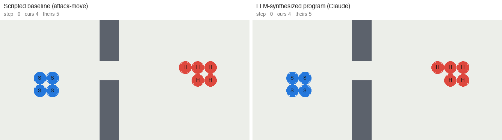

# Teaching AI to Micro in StarCraft: 16 Rounds, and the Protagonist Didn't Make the Cut

> **The plan:** let **Jev**, a typed-choice model that answers multiple-choice questions with calibrated probabilities, make the tactical calls in SMAC battles.
> **What happened:** Jev was tried in 12 different decision roles across four generations of the system. None of them significantly beat the default of its day.
> **What actually worked:** a ~150-line Python micro program, written by an LLM that read the simulator's source code. It raised the win rate on 1,000 unseen battles from **47.5% to 72.0%**.

<p align="center">
  
</p>
<p align="center"><sub>
Unseen test battle <code>y0810</code>, seed 4: 4 Stalkers (blue) vs 5 Hydralisks (red), with a wall and a single gap.
Fill = remaining HP; lines = current attack target.
<b>Left:</b> attack-move, damage spread across targets, all four Stalkers dead.
<b>Right:</b> the synthesized program holds back and focuses one Hydralisk at a time as they come through the gap. No Stalker dies.
</sub></p>

## Results

Held-out set **test6**: 200 freshly generated scenarios × 5 seeds = 1,000 battles. Each test set is run exactly once.
Only contested scenarios are kept: the generator drops fights the baseline wins 5/5, and fights both the baseline and a random policy lose 5/5.

| Method | Win rate (test6) | 23 official SMAC maps¹ |
|---|---:|---:|
| Scripted baseline (attack-move) | 47.5% | 53 / 115 |
| Value-guided macro-action switching | 51.9% | 51 / 115 |
| LLM program synthesis, outcome feedback (Grok-4.7) | 59.5% | 62 / 115 |
| **LLM program synthesis, source + trace feedback (Claude)** | **72.0%** | **65 / 115** |

Paired comparisons (same scenario, same seed; exact sign test):

| | Flips (+) | Losses (−) | Net | p |
|---|---:|---:|---:|---:|
| Claude program vs Grok program | 170 | 45 | **+125** | < 0.001 |
| Claude program vs scripted baseline | 305 | 60 | **+245** | < 0.001 |

<sub>¹ Reference only. The official maps were used to hand-tune early rules, so they are not a clean test.</sub>

## Three counter-intuitive findings

**1. The feedback channel matters more than the model that writes the code.**
The last two rows share the same interface, sandbox, and fallback; only the feedback differs.
- Grok made 4 calls and saw aggregate scores plus auto-generated critiques.
- Claude read the simulator source, traced lost battles step by step, and re-ran a paired test after every single edit.

The biggest single jump came from reading the source. The API doc said `can_attack(u, e)` meant "in range". It actually means "visible". Units ordered to attack a distant target walk into the enemy line. Fixing that one assumption was the difference between **−100 and +64** (out of 720 battles).

**2. The judgment model never beat k-nearest-neighbors.**
Wherever Jev was given similar past battles as evidence, it mostly followed that evidence. On the opening decision "hold or push?":
- Jev with 8 similar fights: **+6 / 720**;
- the same 8 neighbors' plain majority vote: **+5**.
- The ceiling for that decision is only **+25**.

In round 5, Jev and the evidence vote differed on just 2 of 600 battles.

**3. Small wins on the selection seeds are mostly noise.**
Variant g13 looked **+7** better on the seeds used to pick it. On fresh seeds it was **−14** (p = 0.049). Every improvement under ~2% of the selection battles has to be re-confirmed on seeds that played no part in choosing it.

## Where Jev was tried

Each row is a separate experiment. To count as useful, Jev had to beat both the current default and a simple control given the same information.

| Architecture | Jev's role | Result | Control | Verdict |
|---|---|---|---|---|
| A0 Exams + motor primitives | Answer tactical "exam" questions every step | 77 / 115 | hand rules 92 / 115 | worse |
| A1 Tactic program library | Pick a program at the start of a fight | 84 / 200 | random pick 84 | no gain |
| A1 | Same, with neighbors' match records as evidence | +1, +10 | evidence vote +1, +11 | copies evidence |
| A2 Value-guided switching | Decide only when the value model is unsure | +4 (p = 0.61) | random pick −4 | n.s. |
| A2 | Act as the value model: P(win) per action | AUC 0.787 / 0.857 with examples | HP ratio AUC 0.835 | judges the state, can't rank actions |
| A2 | Win/loss judgment as a gate for risky moves | +5.42 → +0.06 on fresh data | — | did not replicate |
| A4 LLM-written program | Opening hold vs push | +6 / 720 | kNN vote +5 | = kNN |

Full table with all 12 roles: [technical report](results/tech_report.html) (in Chinese).

**Why it didn't help, in one paragraph.**
- **Small headroom.** The choices on offer rarely change the outcome. Even picking the best option per scenario in hindsight is worth only +25 / 720 battles (3.5%) for hold-vs-push, and +24 to +27 / 300 for the A1 program library.
- **The differences are numeric.** Range, cooldown, and positioning are hard to read from text. Jev gave 13 different actions P(win) values with a standard deviation of 0.047.
- **Judging is not acting.** Its win/loss judgment was the best in the project, but SMAC has no retreat or surrender, so knowing you will lose doesn't give you a move that wins.
- **The gains come from execution.** The real improvements came from per-unit, per-step computation: focus-fire allocation, overkill avoidance, and kiting on cooldown. These are natural to write as code and get lost once you turn them into multiple choice.

## Architecture evolution

```
A0  Exams + motor primitives      Jev answers tactical questions; primitives execute
A1  Tactic program library        offline LLM forging per scenario cluster; online: nearest cluster
A2  Value-guided macro switching  every 5 steps, a GBDT value model may swap in 1 of 12 preset tactics
A3  LLM program synthesis (Grok)  act(obs, mem) in a sandbox, overriding A2 unit by unit
A4  LLM program synthesis (Claude) same runtime as A3; source reading + trace-driven dev loop   ← current
```

Each layer hands the units it doesn't command down to the layer below, so the scripted baseline is always the last fallback.

The current program, [`kb/library/code/general_claude.py`](kb/library/code/general_claude.py), does five things:

1. **Focus-fire allocation.** Priority = enemy DPS ÷ remaining effective HP. A damage ledger avoids overkill. Armor and type bonuses are counted.
2. **Medivacs** heal, or retreat when threatened.
3. **Baneling screening.** Melee units intercept Banelings heading for our ranged units.
4. **Kiting.** Step back during weapon cooldown when out-ranging or out-speeding the enemy.
5. **Stall breaker.** If no one has taken damage for 10 steps, attack, because a timeout counts as a loss.

## Quick start

```bash
# Watch one battle step by step (program, split, scenario id, seed, print every N steps)
python results/dev16/trace.py kb/library/code/general_claude.py val v0042 1 10

# Paired dev comparison on the training splits (results cached by program hash)
python results/_dev16.py cmp kb/library/code/general.py kb/library/code/general_claude.py --seeds 1,2,3,4

# Held-out evaluation, then paired statistics
python results/_regress.py holdout --split val --policies dummy written_online --write out.jsonl
python results/_regress.py paired --base dummy --files out.jsonl

# Regenerate the GIF above
python results/readme_gif.py y0810 4
```

Environment: [SMAClite](smaclite/) (a lightweight Python re-implementation of SMAC); one step = 8 ticks ≈ 0.5 s.

## Repository map

| Path | What it is |
|---|---|
| `code_policy.py` | Sandbox and API for LLM-written `act(obs, mem)` programs |
| `kb/library/code/` | The programs: `general_claude.py` (current), `general.py` (Grok) |
| `jev_smac_policy.py` | Online policies, motor primitives, exam menus (A0–A4) |
| `tactic_dsl.py`, `forge.py` | Tactic DSL and offline forging (A1, A3) |
| `search.py`, `value.py` | Offline rollouts and the value model (A2) |
| `scenarios.py` | Procedural scenario generator; frozen train / val / test splits |
| `results/iter*_report.md` | One report per round |
| `results/tech_report.html` | Full technical report |
| `AGENTS.md` | Project conventions and evaluation rules |

## If you want to use a judgment model like Jev

1. **Measure the headroom first.** Pick the best option per scenario on some seeds, then check it on others. If that is only a few percent, it doesn't matter who chooses.
2. **Always compare against "same information, no model".** Use three controls: a random pick among the same candidates, a plain vote over the same examples, and changing nothing.
3. **Use it to judge the state, not to rank actions.** With 8 retrieved examples, Jev's win/loss AUC rose from 0.787 to 0.857. It still couldn't tell actions apart.

It fits tasks with few, high-stakes decisions that can be described in words, *and* where a judgment can be turned into gain through an action like retreat, reinforce, or skip this fight. Full-game StarCraft macro fits that. Small-scale SMAC micro is the opposite.

## Evaluation discipline

- Procedural scenarios with frozen splits: train (60), train2 (120), val (80), and test2–test6 (200 each, **each used exactly once**).
- Every comparison is paired by scenario and seed, with an exact sign test on flips vs losses.
- Selection seeds and confirmation seeds are always disjoint.
- On every change, a regression check confirms the scripted baseline's step-by-step actions are unchanged.
